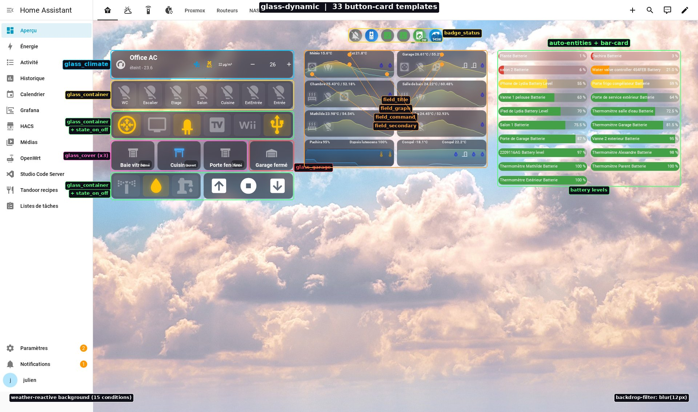
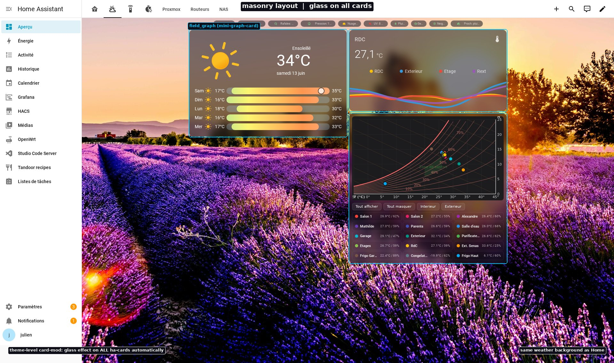
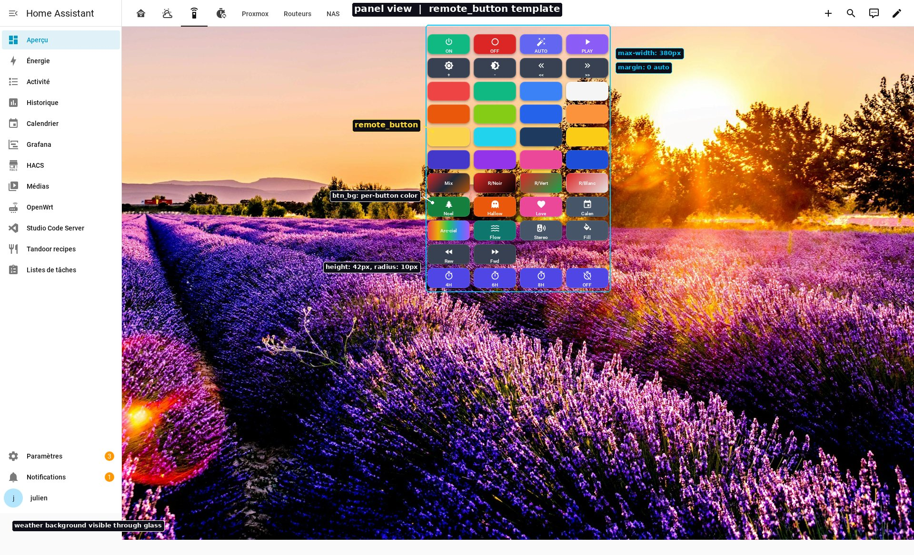
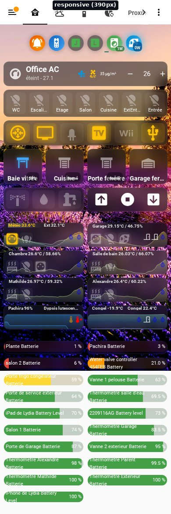

# Glass Dynamic Dashboard for Home Assistant

A stunning glass-morphism theme with **weather-reactive backgrounds** and a complete **button-card template library** for Home Assistant.

[](https://github.com/hacs/integration)
[](https://github.com/jbsky/ha-glass-dashboard/releases)
[](LICENSE)

---

## What makes this different?

| Feature | Frosted Glass Theme | Mobile First | **Glass Dynamic** |
|---------|--------------------:|-------------:|------------------:|
| Glass-morphism | Theme only | No | Theme + per-card |
| Dynamic backgrounds | No | No | 15 weather conditions |
| Button-card templates | No | Config dump | 33 reusable templates |
| Sun-aware (day/night) | No | No | Yes |
| Multi-view themes | No | No | Yes (tech, remote) |
| Remote control layout | No | No | Compact 4-col grid |
| Climate component | No | No | Full HVAC widget |

---

## Features

### Weather-Reactive Background
The dashboard background changes automatically based on your local weather — sunny, rainy, stormy, snowy, foggy... with night-time variants when the sun goes below the horizon.

### Glass-Morphism Everywhere
Every card gets a frosted glass effect via `card-mod`:
- `backdrop-filter: blur(12px)` for the glass effect
- Semi-transparent dark background
- Subtle light borders
- Consistent across all card types

### 33 Button-Card Templates
A complete template library organized by function:

| Category | Templates | Purpose |
|----------|-----------|---------|
| **Core Glass** | `glass_button`, `glass_container`, `glass_button_base` | Base glass cards |
| **Components** | `glass_climate`, `glass_cover`, `glass_garage` | Full device widgets |
| **Fields** | `field_command`, `field_graph`, `field_title`, `field_secondary` | Card sub-components |
| **States** | `state_on_off`, `animation_effects` | Visual state feedback |
| **Sensors** | `battery_level`, `humidity_template`, `temperature_template` | Sensor display |
| **Remote** | `remote_button`, `remote_separator` | IR/RF remote grid |
| **Badges** | `badge_base`, `badge_status` | Status indicators |

### Climate Widget (`glass_climate`)
A self-contained HVAC component with:
- Power button with state coloring
- Current temperature display
- Target temperature up/down controls
- Status text (heating/cooling/idle)
- Optional secondary sensors (air quality, fan control)

```yaml
type: custom:button-card
template: glass_climate
variables:
  climate_entity: climate.living_room
  secondary_sensors:
    - sensor.air_quality_pm25
    - input_boolean.fan_control
```

### Cover Widget (`glass_cover`)
Animated shutter/blind control:
- Open/close/stop buttons
- Position badge with percentage
- Animated icon (opens/closes with state)

### Remote Control Layout
Compact colored button grid for IR/RF remotes:
- 4-column layout, physically compact (380px max-width)
- Colored buttons with customizable backgrounds
- Works great on mobile as a dedicated panel view

---

## Screenshots

| Home | Weather | Remote |
|:---:|:---:|:---:|
|  |  |  |

<details>
<summary>Mobile view</summary>



</details>

---

## Installation

### HACS (Recommended)

1. Open HACS in your HA instance
2. Click the 3-dot menu → **Custom repositories**
3. Add `https://github.com/jbsky/ha-glass-dashboard` with category **Theme**
4. Install "Glass Dynamic Dashboard"
5. Restart Home Assistant

### Manual Installation

1. Copy `themes/glass-dynamic/` to your `/config/themes/` directory
2. Copy background images from `backgrounds/weather/` to `/config/www/backgrounds/weather/`
3. Add templates from `templates/` to your lovelace `button_card_templates`
4. Restart Home Assistant

---

## Configuration

### 1. Theme Setup

In your `configuration.yaml`:
```yaml
frontend:
  themes: !include_dir_merge_named themes
```

### 2. Weather Entity

Edit `themes/glass-dynamic/glass-dynamic.yaml` and replace `weather.home` with your weather entity:
```yaml
# Find and replace all occurrences of:
weather.home
# With your entity, e.g.:
weather.my_city
```

### 3. Background Images

Place the 15 weather images in `/config/www/backgrounds/weather/`:
```
clearnight.jpg    cloudy.jpg        exceptional.jpg
fog.jpg           hail.jpg          lightning.jpg
lightningrainy.jpg  partlycloudy.jpg  pouring.jpg
rainy.jpg         snowy.jpg         snowyrainy.jpg
sunny.jpg         windy.jpg         windyvariant.jpg
```

See [backgrounds/README.md](backgrounds/README.md) for sourcing guidelines.

### 4. Button-Card Templates

Add templates to your dashboard. In the raw config editor:

```yaml
button_card_templates:
  # Paste contents of templates/glass-core.yaml here
  glass_button_base:
    ...
```

Or use [decluttering-card](https://github.com/custom-cards/decluttering-card) for template management.

---

## Requirements

- [card-mod](https://github.com/thomasloven/lovelace-card-mod) (required for glass effect + dynamic backgrounds)
- [button-card](https://github.com/custom-cards/button-card) (required for templates)
- [mini-graph-card](https://github.com/kalkih/mini-graph-card) (optional, for `field_graph`)
- [scheduler-card](https://github.com/nielsfaber/scheduler-card) (optional, for scheduling view)
- A weather integration configured (e.g., Met.no, OpenWeatherMap)

---

## Template Reference

### Glass Components

#### `glass_climate`
Full HVAC control widget.

| Variable | Required | Description |
|----------|----------|-------------|
| `climate_entity` | Yes | Climate entity ID |
| `secondary_sensors` | No | Array of up to 3 sensor entity IDs |

#### `glass_cover`
Shutter/blind control with animation.

| Variable | Required | Description |
|----------|----------|-------------|
| `cover_entity` | Yes | Cover entity ID |

#### `glass_garage`
Garage door control.

| Variable | Required | Description |
|----------|----------|-------------|
| `garage_entity` | Yes | Cover entity ID (garage type) |

### Remote Buttons

#### `remote_button`
Colored button for remote control grids.

| Variable | Default | Description |
|----------|---------|-------------|
| `btn_bg` | `#374151` | Button background color |
| `btn_color` | `#FFFFFF` | Text/icon color |
| `btn_height` | `48px` | Button height |

---

## Multi-View Setup

The theme supports multiple views with different personalities:

```yaml
views:
  - title: Home
    theme: glass-dynamic    # Weather background
  - title: Weather
    theme: glass-dynamic    # Same dynamic background
  - title: Remote
    type: panel
    theme: glass-dynamic    # Works on panel views too
  - title: Proxmox
    theme: proxmox-tech     # Custom tech background (optional)
```

---

## Customization

### Changing the glass intensity
In the theme file, adjust:
```yaml
ha-card-background: "rgba(20, 20, 30, 0.55)"  # opacity (0.3 = lighter, 0.7 = darker)
```

And in `card-mod-card-yaml`:
```yaml
backdrop-filter: blur(12px) !important;  # blur radius (8px = subtle, 20px = heavy)
```

### Adding your own backgrounds
The theme uses a Jinja2 map in `card-mod-view`. Add new conditions:
```yaml

```

---

## Credits

- Glass-morphism inspired by [glassmorphism.com](https://glassmorphism.com)
- Background photos from [Unsplash](https://unsplash.com) (free license)
- Built with [card-mod](https://github.com/thomasloven/lovelace-card-mod) and [button-card](https://github.com/custom-cards/button-card)

---

## Contributing

Contributions welcome! Feel free to:
- Submit new background photos
- Add button-card templates for new device types
- Improve documentation
- Report issues

---

## License

MIT - See [LICENSE](LICENSE)
